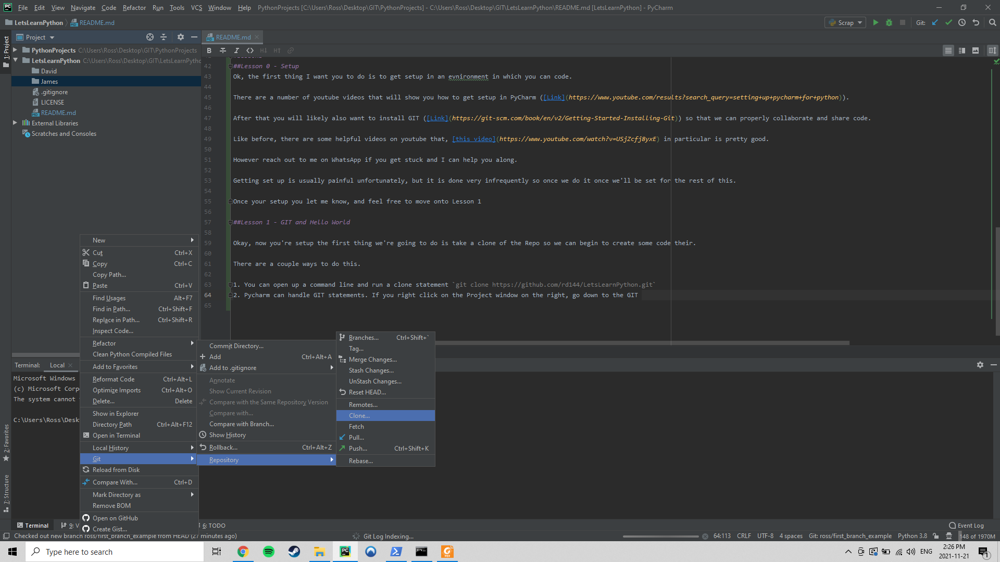
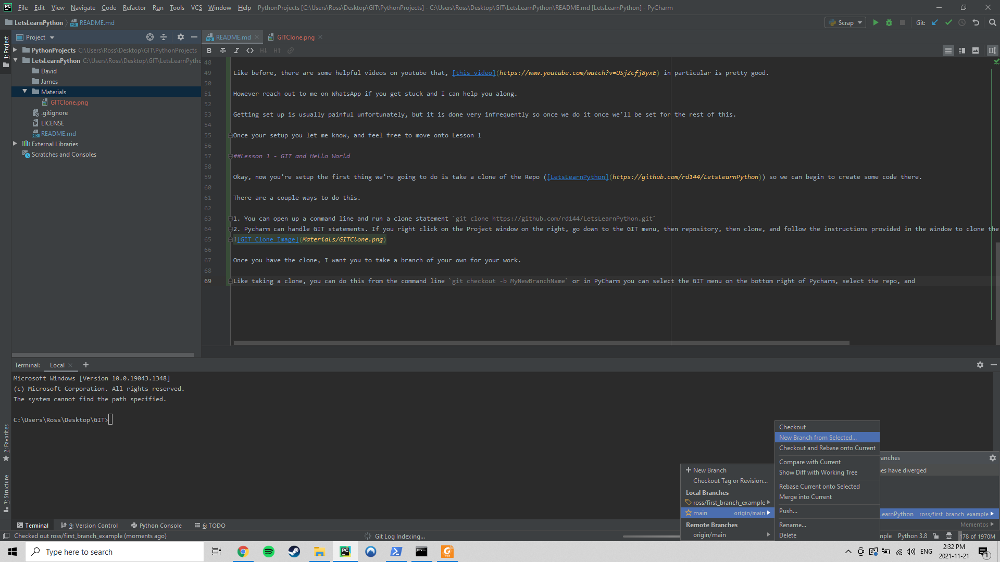

# LetsLearnPython

# Introduction

Alrighty, this is a repo for the three of us to go over some python basics and see if we can learn a bit more together.

In the same vein that you've not learnt python before I haven't taught it, but I'm hoping to impart at least some knowledge to you both. However if you have any issues or questions do let me know.

Firstly, this file is called a "README" and is done in a language called "Markdown" it's a standard and fairly basic form of code that holds information on the repo and usually allows uses to get an idea of what the programs on the repo are meant to do.

You can see an example of a relatively well formed on on the main branch of my [PythonProjects repo](https://github.com/rd144/PythonProjects)

The formatting of Markdown is pretty simple, here is a pretty useful cheat sheet for it [here](https://www.markdownguide.org/cheat-sheet/).

Secondly, I recommend finding an Integrated Development Environment (or IDE) in which you can develop your code.

I personally use PyCharm ([Download Link](https://www.jetbrains.com/pycharm/download/download-thanks.html?platform=windows&code=PCC)), and that works prett well for me.

# Structure

So the general structure I'm thinking of going with is very similair to how I was taught, a very much learn by doing approach.

I will assign problems for you to solve, and once you have created a Merge Request I'll review it, ask you questions on it, and if it looks good, we'll merge it into your respective folder.

The skills I'll look to cover include:

- Learn how to use GIT (Add, Remove, Review, Merge etc.)
- Learn how to use the .gitignore
- Printing to screen in Python
- Reading/Writing files
- Relative Filepaths
- Logical Statements (IF X AND Y DO Z etc.)
- Iteration Loops (WHILE and FOR and when to use them)
- Creating Methods
- Object Oriented Programming (OOP) and Creating Classes
- Importing Methods/Classes from other locations
- PIP Installing Libraries

After you are able to do all this pretty well we an try and do a project together on a common interest and see what we can build.

# Lessons

## Lesson 0 - Setup
Ok, the first thing I want you to do is to get setup in an evnironment in which you can code.

There are a number of youtube videos that will show you how to get setup in PyCharm ([Link](https://www.youtube.com/results?search_query=setting+up+pycharm+for+python)).

After that you will likely also want to install GIT ([Link](https://git-scm.com/book/en/v2/Getting-Started-Installing-Git)) so that we can properly collaborate and share code.

Like before, there are some helpful videos on youtube that, [this video](https://www.youtube.com/watch?v=USjZcfj8yxE) in particular is pretty good.

However reach out to me on WhatsApp if you get stuck and I can help you along.

Getting set up is usually painful unfortunately, but it is done very infrequently so once we do it once we'll be set for the rest of this.

Once your setup you let me know, and feel free to move onto Lesson 1

## Lesson 1 - GIT and Hello World

Okay, now you're setup the first thing we're going to do is take a clone of the Repo ([LetsLearnPython](https://github.com/rd144/LetsLearnPython)) so we can begin to create some code there.

There are a couple ways to do this.

1. You can open up a command line and run a clone statement `git clone https://github.com/rd144/LetsLearnPython.git`
2. Pycharm can handle GIT statements. If you right click on the Project window on the right, go down to the GIT menu, then repository, then clone, and follow the instructions provided in the window to clone the repo to the provided directory

Once you have the clone, I want you to take a branch of your own for your work.

Like taking a clone, you can do this from the command line `git checkout -b MyNewBranchName` or in PyCharm you can select the GIT menu on the bottom right of Pycharm, select the repo, select main, select "New Branch From Selected" Then just name it what you want, and it'll create a new branch for you to work on that wont affect the code on main.

Once you have a branch, create ANY file in your directory. I dont mind what it is. Copy and paste an image from the internet. Create a text file saying Hi. Do whatever. Just put it in your folder, use `git add` to add the file to your branch, use `git commit -m "Message about what you've done"` to make a commit, and then finally use `git push` to push the change to Origin. 

This is basically just syncing what's on your PC (referred to as local) with what's on the repo that we can all see (called remote)

Once the file is on remote (you'll be able to see the branch listed [here](https://github.com/rd144/LetsLearnPython/branches), let me know and we can move on to the next step (Creating a Merge Request and Starting with Hello World)

If you want to work with GIT through the command line, or understand what PyCharm is doing in the background, [this cheatsheet](https://wac-cdn.atlassian.com/dam/jcr:e7e22f25-bba2-4ef1-a197-53f46b6df4a5/SWTM-2088_Atlassian-Git-Cheatsheet.pdf?cdnVersion=99) is a pretty helpful reference tool
